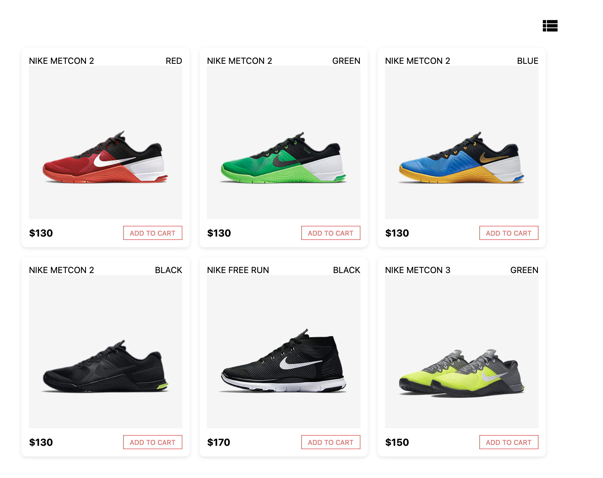
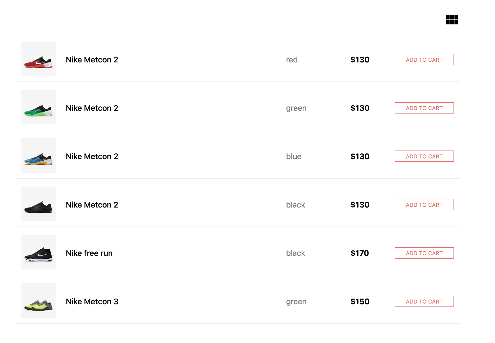

## Available Scripts

In the project directory, you can run:

### `npm start`
### `npm test`
### `npm run build`

# Store Layout

Simple React app for displaying products in two different layouts: grid view and list view.

The project shows how to switch between layouts and render product cards from JSON data.

## Features

- Grid view
- List view
- Layout switch button

## Technologies

- React

## Screenshots

### Grid View

### List View

